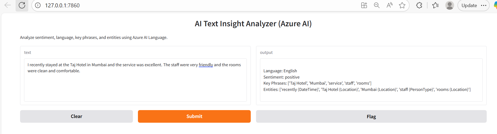

🧠 AI Text Insight Analyzer

This project is a simple AI-powered web application that analyzes text using Azure AI Language Service.
Users can enter any text and get insights such as sentiment, language, key phrases, and named entities.

The goal of this project is to demonstrate how Azure’s NLP (Natural Language Processing) capabilities can be integrated into a Python application and deployed as a web app.

🚀 What this project does

This application allows users to input text and automatically analyzes it using Azure AI.

The app can:

Detect the language of the text

Identify sentiment (positive, negative, neutral)

Extract important key phrases

Recognize named entities (people, places, organizations, etc.)

Example:
Input text → “I loved the service at Taj Hotel in Mumbai.”
Output:

Language: English

Sentiment: Positive

Key phrases: service, Taj Hotel, Mumbai

Entities: Taj Hotel (Organization), Mumbai (Location)

💬 What is Sentiment Analysis?

Sentiment analysis is a Natural Language Processing (NLP) technique that determines whether text expresses a positive, negative, or neutral emotion.

It is commonly used for:

Customer reviews

Feedback analysis

Social media monitoring

Product opinions

Example:

“This product is amazing” → Positive

“The service was terrible” → Negative

☁️ What is Azure AI Language Service?

Azure AI Language Service is a cloud-based service provided by Microsoft Azure that enables developers to analyze text using AI.

It provides prebuilt NLP features such as:

Language detection

Sentiment analysis

Key phrase extraction

Entity recognition

Text summarization

Instead of building machine learning models from scratch, developers can call Azure APIs to analyze text quickly and at scale.

This project uses Azure AI Language Service to process text and return insights.

🛠 Tech Stack

Python

Azure AI Language Service

Gradio (for web UI)

dotenv (for environment variables)

Run locally:
pip install -r requirements.txt

python app.py

## Screenshot

